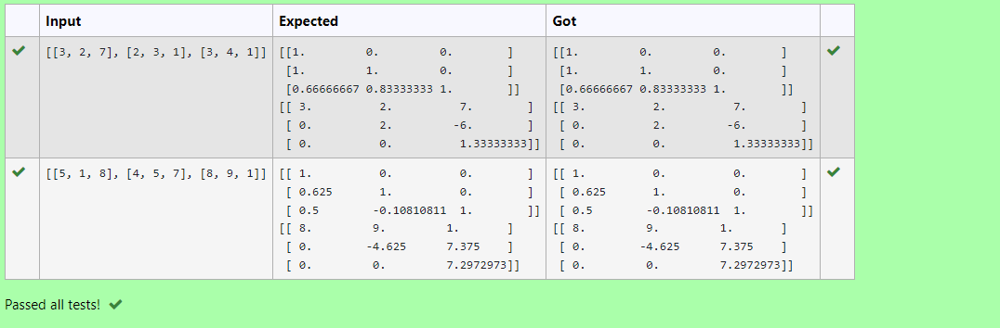
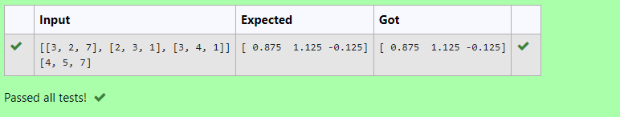

# LU Decomposition 

## AIM:
To write a program to find the LU Decomposition of a matrix.

## Equipments Required:
1. Hardware – PCs
2. Anaconda – Python 3.7 Installation / Moodle-Code Runner

## Algorithm
1. 
2. 
3. 
4. 

## Program:
```python
'''
Program to find L and U matrix using LU decomposition.
Developed by:MOhammed imthiyas.M
RegisterNumber: 22005042
'''

import numpy as np
from scipy.linalg import lu
A = np.array(eval(input()))
P, L, U = lu(A)
print(L)
print(U)
```
(ii) To find the LU Decomposition of a matrix
```python
'''
Program to solve a matrix using LU decomposition.
Developed by::MOhammed imthiyas.M
RegisterNumber: 22005042
'''

# To print X matrix (solution to the equations)
import numpy as np
from scipy.linalg import lu_factor, lu_solve
A = np.array(eval(input()))
b = np.array(eval(input()))
lu, piv = lu_factor(A)
x = lu_solve((lu, piv), b)
print(x)
```

## Output:




## Result:
Thus the program to find the LU Decomposition of a matrix is written and verified using python programming.

